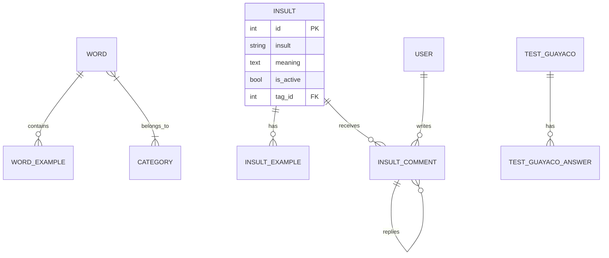

# Guía de Base de Datos: Arrechoteca API

Esta guía detalla la estructura actual de la base de datos PostgreSQL para el backend de Arrechoteca.

## 📐 Diagrama de Entidad-Relación (ER)

## 🗂️ Diccionario de Tablas

### 🔹 Palabras y Diccionario
- **`words`**: Tabla principal de jerga.
- **`categories`**: Clasificación (ej: "Expresión", "Palabra Suelta").
- **`word_category`**: Tabla intermedia (N:N).
- **`word_examples`**: Frases ilustrativas.

### 🔹 Módulo de Insultos (Puteadas)
- **`insults`**: Almacén de insultos.
- **`insult_tags`**: Etiquetas descriptivas.
- **`insult_examples`**: Ejemplos específicos.
- **`insult_stars`**: Puntuación de insultos por usuarios.

### 🔹 Foro y Usuarios
- **`users`**: Datos de Supabase (ID, email, etc.).
- **`insult_comments`**: Comentarios. Posee `parent_id` para hilos de discusión.
- **`comment_likes`** / **`comment_stars`**: Reacciones a comentarios.

### 🔹 Test Guayaco
- **`test_guayaco`**: Preguntas del trivia.
- **`test_guayaco_answers`**: Opciones de respuesta.

## 🛠️ Reglas de Oro de la Base de Datos
1. **Activo por Defecto**: Las campos `is_active` deben estar en `False` por defecto para permitir la moderación (especialmente en insultos y palabras nuevas).
2. **Relaciones en Cascade**: Las tablas hijas (`examples`, `comments`) deben configurarse con `cascade="all, delete-orphan"` en SQLAlchemy para evitar registros huérfanos.
3. **UUIDs**: La tabla `users` utiliza el ID de Supabase como `String(255)` (UUID). No usar autoincrementales para usuarios.

---
*Consulta este documento antes de proponer cambios estructurales o nuevas migraciones.*
